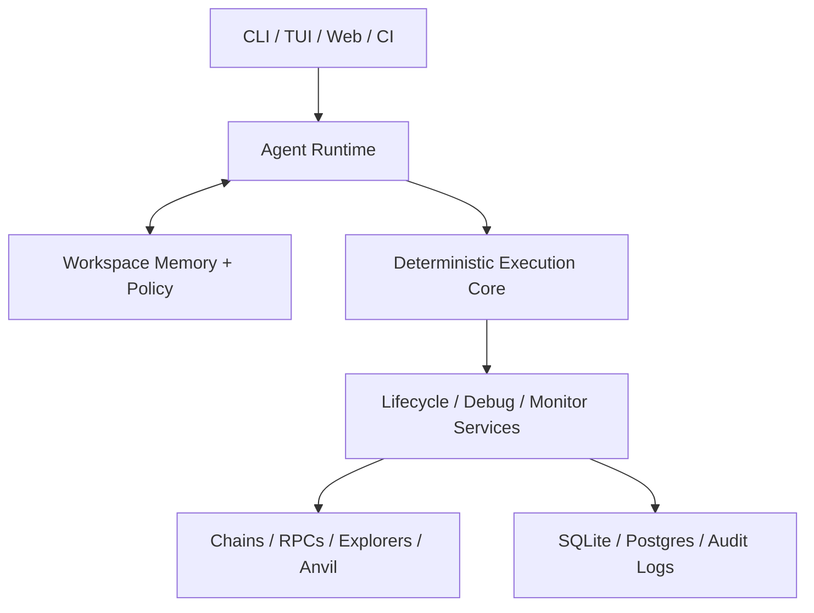

# ChainMind System Architecture

## Overview

ChainMind is a layered platform that keeps AI decision-making separate from deterministic blockchain execution.

## Architectural Principles

- AI proposes plans; deterministic components execute validated steps.
- Safety boundaries are explicit and testable.
- Core blockchain operations must work without the web surface.
- Multi-chain concerns belong in shared infrastructure, not per-feature hacks.
- Persistence should support both local mode and future collaborative mode.

## Implementation Direction

The implementation should use a TypeScript and Node.js monorepo:

- `apps/cli` for the main CLI and optional TUI surfaces
- `packages/*` for chain, wallet, transaction, contract, memory, agent, monitoring, and policy modules
- `apps/web` for the Next.js companion dashboard

Recommended framework choices:

- `oclif` for CLI routing and command composition
- `viem` for EVM clients, contracts, calldata, simulation, and signing workflows
- SQLite for local-first persistence
- Vitest for unit and integration testing

The key architectural consequence is that the same TypeScript domain packages should power both the CLI and the web app instead of splitting logic across multiple backend languages.

## Layer Breakdown

### 1. Interface Layer

Responsibilities:

- accept commands or natural-language requests
- render task progress and results
- collect approvals when required
- present traces, simulations, and contract interaction UIs

Components:

- CLI command router
- TUI views
- web companion
- CI entry points

### 2. Agent Runtime

Responsibilities:

- parse intent
- plan steps
- retrieve memory
- choose tools
- enforce approval checkpoints
- synthesize outputs

The agent runtime must not perform direct chain actions itself.

### 3. Deterministic Execution Core

Responsibilities:

- resolve chain metadata
- select and benchmark RPC providers
- build calldata and transactions
- estimate gas and manage nonce behavior
- simulate writes where supported
- sign or broadcast only after policy approval

This layer is the trusted executor for the platform.

### 4. Developer Services

Responsibilities:

- contract deployment and verification
- contract studio interaction flows
- trace and revert analysis
- fork and simulation workflows
- monitoring and scheduled operations

These services are consumers of the execution core rather than peers to it.

### 5. Persistence and Platform Services

Responsibilities:

- workspace config and project state
- execution history
- known contracts and addresses
- stored traces and reports
- approvals and audit logs
- team and CI data later

## Request Lifecycle

1. Receive user request.
2. Normalize into a task object.
3. Load workspace context and policies.
4. Produce a plan.
5. Validate plan against safety boundaries.
6. Execute each step through deterministic tools.
7. Persist outputs and observations.
8. Return both narrative and structured results.

## Operating Modes

### Local Mode

- single-user
- SQLite-backed
- keychain or hardware wallet focused
- CLI and TUI as primary interfaces

### Team Mode

- shared state
- Postgres-backed
- stronger RBAC and policy enforcement
- CI/CD and collaboration workflows
- richer web visibility

## Reliability Considerations

- read-only steps can retry safely
- signing and broadcasting require explicit handling and no silent retries
- every execution should be replayable from logs where possible
- failure categories should be machine-readable and user-readable
